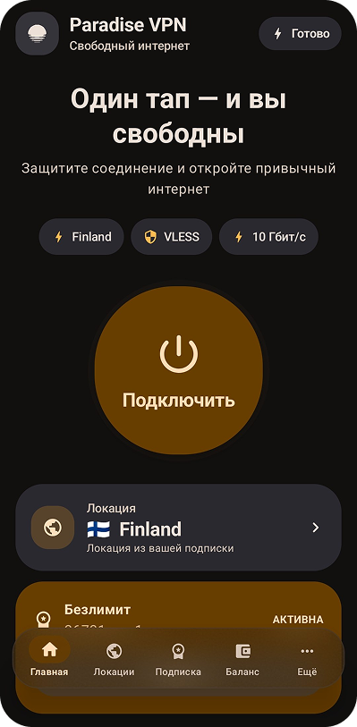

<p align="center">
  
  
</p>

<p align="center">
  <a href="https://github.com/paradise-inc-off/Paradise-VPN-Android/stargazers"></a>
  <a href="https://github.com/paradise-inc-off/Paradise-VPN-Android/releases"></a>
  <a href="https://github.com/paradise-inc-off/Paradise-VPN-Android/releases/latest"></a>
  <a href="https://github.com/paradise-inc-off/Paradise-VPN-Android/releases/latest"></a>
</p>

<p align="center">
  
  
  <a href="https://www.virustotal.com/gui/file/eef5bcb36fe40ff6f25c921b28082caebba4ba6a642c012a2650e4ea558ee45f">
    
  </a>
</p>

Официальный Android-клиент **Paradise VPN** с нативным VPN-движком, современным интерфейсом **Material 3 Expressive (Android 17)** и полным управлением сервисом прямо из приложения.

> Актуальная версия: **1.1.2**

---

## ✨ Возможности

### ⚡ Высокоскоростное подключение
* 🔐 **Нативное VPN-подключение**: Системный Android `VpnService` + высокопроизводительный **Xray TUN** (TCP / UDP, IPv4 / IPv6).
* 🌍 **Smart Auto & Выбор локаций**: Автоматический подбор оптимального сервера и ручной выбор стран с замером пинга.
* 🔀 **Раздельное туннелирование (Split Tunneling)**: Выбор приложений, работающих через VPN или напрямую.
* ⚡ **Плитка в быстрых настройках**: Управление подключением прямо из шторки Android (Quick Settings Tile).
* ⏱️ **Метрики в реальном времени**: Живой таймер текущей сессии и подсчёт суммарного времени защиты.

### 👤 Управление аккаунтом и сервисом
* ✈️ **Авторизация**: Быстрый вход по Email или в один клик через Telegram.
* 💳 **Подписка и баланс**: Продление, автоплатёж, пополнение баланса, история операций и промокоды.
* 🎁 **Пробный период**: Мгновенная активация бесплатного пробного периода для новых пользователей.
* 🔄 **Перевыпуск подписки**: Генерация новой ссылки и безопасный сброс активных сессий в один клик.
* 📱 **Управление устройствами**: Докупка дополнительных слотов для устройств и отключение неактивных.
* 🎁 **Подарочные подписки**: Покупка подарков с баланса или платёжного шлюза, отправка кодов и их активация.
* 💬 **Поддержка и рефералы**: Реферальная система и обращения в службу заботы.

### 🎨 Интерфейс и системная интеграция
* 📱 **Material 3 Expressive (Android 17)**: Обновлённые компоненты (скругления 26–36 dp), переключатели со статусом внутри ползунка (`✓` / `×`), пружинные анимации и поддержка Dynamic Color (обои Android 12+).
* 🔄 **Прямые обновления с GitHub**: Автоматическая проверка новых релизов, просмотр чейнджлога и загрузка APK прямо в приложении.
* 🌐 **Двуязычный интерфейс**: Полная локализация на 🇷🇺 Русский и 🇬🇧 English.

---

## 🔐 Архитектура VPN

```text
Android-приложения
        ↓
Android VpnService
        ↓
Xray-core TUN Engine
        ↓
Paradise VPN Infrastructure
        ↓
Защищённый Интернет
```

* Конфигурации и ключи защищены на сервере и обновляются автоматически.
* Приложение поддерживает серверную балансировку, встроенный DNS и устойчивую маршрутизацию при нестабильной мобильной сети.

---

## 🛡️ Безопасность

* Чувствительные данные авторизации шифруются на устройстве через **Android Keystore + AES/GCM**.
* Приложение не хранит открытые приватные ключи инфраструктуры в коде APK.

| Параметр | Значение |
| :--- | :--- |
| **Хеш SHA-256** | `EEF5BCB36FE40FF6F25C921B28082CAEBBA4BA6A642C012A2650E4EA558EE45F` |
| **Отчёт VirusTotal** | [Открыть отчёт сканирования](https://www.virustotal.com/gui/file/eef5bcb36fe40ff6f25c921b28082caebba4ba6a642c012a2650e4ea558ee45f) |

---

## 📥 Установка

1. Откройте раздел [Releases](https://github.com/paradise-inc-off/Paradise-VPN-Android/releases).
2. Выберите актуальную версию (**v1.1.2**).
3. Скачайте файл **`.apk`** из блока **Assets**.
4. Установите и запустите приложение на вашем Android-устройстве.
5. При первом подключении подтвердите стандартный системный запрос Android на создание VPN-профиля.

> Рекомендуется скачивать Paradise VPN только из официального GitHub-репозитория или официальных ресурсов проекта.

---

## 🔗 Официальные ресурсы

* 🌐 **Официальный сайт:** [paradisevpn.su](https://paradisevpn.su)
* 👤 **Личный кабинет:** [cabinet.paradisevpn.su](https://cabinet.paradisevpn.su)
* 📢 **Telegram-канал:** [@para_dise_vpn](https://t.me/para_dise_vpn)
* 🤖 **Telegram-бот:** [@paradise_vpn_bot](https://t.me/paradise_vpn_bot)

---

<p align="center">
  <b>Paradise VPN for Android</b><br>
  Скорость. Приватность. Нативность.
</p>
