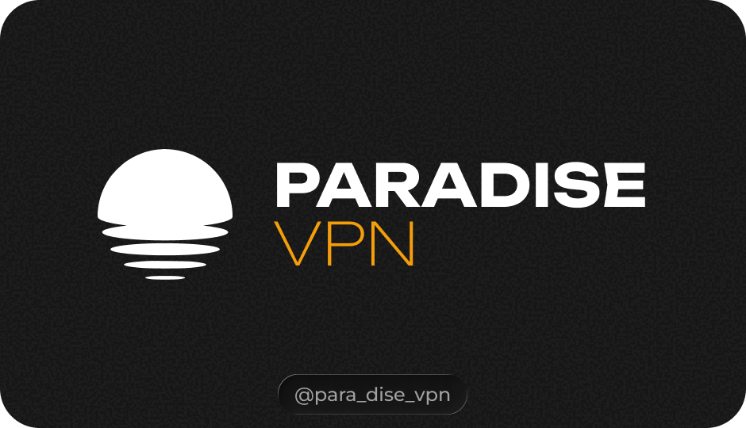

Официальный Android-клиент **Paradise VPN** с нативным VPN-подключением, современным интерфейсом и полной интеграцией с личным кабинетом.

Приложение создано специально для Android и не требует сторонних VPN-клиентов для подключения к Paradise VPN.

> Актуальная версия: **0.8.6**

---

## 🔎 Проверка и безопасность

[](https://www.virustotal.com/gui/file/eef5bcb36fe40ff6f25c921b28082caebba4ba6a642c012a2650e4ea558ee45f)

**SHA-256**
```text
EEF5BCB36FE40FF6F25C921B28082CAEBBA4BA6A642C012A2650E4EA558EE45F
```

---

## 📱 О приложении

Paradise VPN для Android объединяет в одном приложении:

* подключение и отключение VPN;
* автоматический выбор сервера;
* ручной выбор локации;
* управление аккаунтом;
* регистрацию;
* пробный период;
* управление подпиской;
* оплату и продление;
* устройства;
* промокоды;
* реферальную систему;
* поддержку;
* быстрый доступ к VPN из панели Android.

VPN работает через системный **Android VpnService** и нативный **Xray-core TUN**.

---

## ✨ Возможности

### 🔐 VPN-подключение

* Нативный Android VPN через `VpnService`
* Xray-core Native TUN
* TCP и UDP
* IPv4 и IPv6
* Подключение в один тап
* Автоматический режим **Auto**
* Ручной выбор сервера
* Реальное отображение состояния подключения
* Корректная работа системного VPN-индикатора Android

Приложение получает готовую VPN-конфигурацию непосредственно от серверной инфраструктуры Paradise VPN, поэтому логика маршрутизации и балансировки остаётся централизованной.

---

## ⚡ Auto

Режим **Auto** использует серверный профиль балансировки Paradise VPN.

Приложение не пытается самостоятельно выбирать или перестраивать внутреннюю конфигурацию серверов, а получает готовый профиль подключения.

Это позволяет сохранять:

* балансировку нагрузки;
* fallback-маршруты;
* direct-routing правила;
* серверные настройки DNS;
* актуальную конфигурацию доступных серверов.

---

## 🌍 Локации

Список доступных серверов автоматически загружается из персональной подписки пользователя.

Можно:

* использовать **Auto**;
* выбрать конкретную страну или сервер;
* обновить список серверов;
* автоматически обновлять конфигурацию в фоне.

Доступные интервалы автоматического обновления:

* Выключено
* 6 часов
* 12 часов
* 24 часа

По умолчанию используется интервал **12 часов**.

---

## 👤 Аккаунт

Авторизация и управление аккаунтом доступны непосредственно в приложении.

Поддерживается:

* вход по Email и паролю;
* регистрация нового аккаунта;
* вход через Telegram;
* автоматическое обновление сессии;
* просмотр профиля;
* просмотр подписки;
* баланс;
* автоплатёж;
* способы оплаты;
* промокоды;
* список устройств;
* подарки;
* реферальная программа;
* обращения в поддержку;
* ответы на тикеты.

---

## 🎁 Пробный период

Новые пользователи могут проверить доступность пробного периода и активировать его прямо в приложении.

После регистрации Paradise VPN автоматически пытается загрузить:

* данные аккаунта;
* подписку;
* доступные серверы;
* VPN-конфигурации;
* список устройств.

В версиях `0.8+` первоначальная синхронизация была переработана, чтобы данные появлялись сразу после регистрации или входа без необходимости перезапускать приложение.

---

## 💳 Подписка и оплата

Подписку можно продлевать непосредственно через приложение.

Поддерживаются:

* варианты продления;
* создание платежа;
* отображение процесса формирования платёжной ссылки;
* способы оплаты;
* баланс;
* промокоды;
* автоплатёж.

---

## 📲 Устройства

Paradise VPN автоматически регистрирует текущее Android-устройство в системе подписки.

Используется постоянный идентификатор устройства, благодаря чему телефон корректно определяется при:

* авторизации;
* обновлении подписки;
* загрузке серверов;
* подключении VPN.

После подключения список устройств автоматически обновляется, поэтому смартфон появляется в:

**Подписка → Мои устройства**

без ручной перезагрузки приложения.

---

## ⚡ Быстрые настройки Android

Paradise VPN поддерживает собственную плитку в панели быстрых настроек.

Её можно добавить через:

**Paradise VPN → Ещё → Добавить плитку**

Плитка позволяет управлять VPN без открытия приложения.

* первое нажатие — подключение;
* повторное нажатие — отключение.

Используется последняя выбранная локация либо **Auto**.

Состояние плитки соответствует реальному состоянию VPN.

---

## 🎨 Интерфейс

Paradise VPN использует современный интерфейс Android на базе:

* Kotlin
* Jetpack Compose
* Material 3 Expressive
* Expressive Motion
* Navigation 3
* Haze
* Blur / Glass эффекты
* Floating Navigation

Начиная с версии `0.8`, приложение также содержит отдельный onboarding при первом запуске.

Поддерживаются:

* 🇷🇺 Русский
* 🇬🇧 English

Язык приложения можно менять отдельно от системного языка Android.

---

## 🛡️ Безопасность

Данные авторизации хранятся в зашифрованном виде с использованием:

* Android Keystore
* AES/GCM

Приложение использует Access Token и Refresh Token и автоматически обновляет авторизацию при истечении сессии.

---

## 🧠 VPN Engine

Упрощённая схема работы:

```text
Android-приложения
        ↓
Android VpnService
        ↓
TUN
        ↓
Xray-core
        ↓
Конфигурация Paradise VPN
        ↓
VPN-сервер
        ↓
Интернет
```

Paradise VPN использует нативный TUN-интерфейс Xray вместо локальных SOCKS/HTTP proxy-inbound'ов.

При этом сохраняется серверная конфигурация:

```text
dns
routing
outbounds
balancers
burstObservatory
fallback
server-side routing
```

Само приложение Paradise VPN исключается из собственного VPN-туннеля, чтобы запросы API и соединения Xray не создавали сетевую петлю.

---

## 📥 Как скачать и установить

1. Откройте раздел **Releases** в этом репозитории.
2. Выберите последнюю доступную версию Paradise VPN.
3. В разделе **Assets** скачайте выбранный файл.
4. Откройте скачанный APK на Android-устройстве.
5. Если система попросит разрешить установку приложений из этого источника — предоставьте разрешение.
6. Нажмите **Установить**.
7. После установки откройте Paradise VPN и войдите в аккаунт или зарегистрируйтесь.

При первом подключении Android покажет системный запрос на создание VPN-подключения — его необходимо подтвердить.

> Рекомендуется скачивать APK только из официального GitHub-репозитория Paradise VPN или по ссылкам с официальных ресурсов Paradise VPN.

После скачивания файл можно дополнительно проверить по опубликованному **SHA-256** и через **VirusTotal**.

---

## 🔗 Официальные ресурсы

**Сайт:** `https://paradisevpn.su`

**Telegram:** `@para_dise_vpn`

**Telegram-бот:** `@paradise_vpn_bot`

**Личный кабинет:** `https://cabinet.paradisevpn.su`

---

## Paradise VPN

Современный нативный Android-клиент Paradise VPN с полноценным Xray TUN, интеграцией с Remnawave, управлением подпиской и быстрым подключением без сторонних VPN-приложений.
